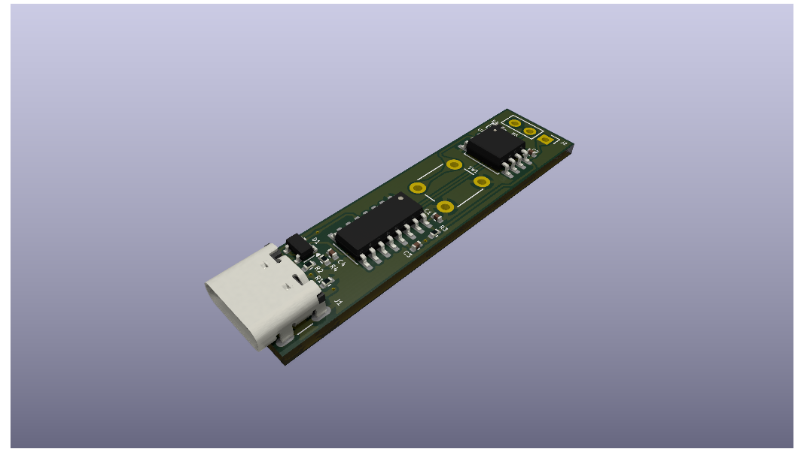

<!-- PROJECT LOGO -->

    
<h3 align="center">00.25.0029 - Do Not Disturb Indicator Light</h3>

<!-- ABOUT THE PROJECT -->

### About The Project

---

This repository provides a comprehensive system to control an WS2812B LED using an ATTINY-85. It includes PCB files, 3D print files, firmware, and software for setting up and operating the system. The firmware implements a serial communication protocol for sending color and brightness commands to the WS2812B LED, using a packet structure with error-checking mechanisms. This setup allows for easy integration and customization of the do not disturb sign.

<!-- BUILD WITH -->
### Built With

* ![KiCad]
* ![VSCode]
* ![Visual Studio]
* ![SimulIDE]

<!-- LICENSE -->
### License

---
See `LICENSE` for more information.

<!-- MARKDOWN LINKS & IMAGES -->
<!-- https://www.markdownguide.org/basic-syntax/#reference-style-links -->
[KiCad]: https://img.shields.io/badge/KiCad-3F7D1F?style=for-the-badge&logoColor=white&labelColor=3F7D1F
[VSCode]: https://img.shields.io/badge/VSCode-007ACC?style=for-the-badge&logoColor=white&labelColor=007ACC
[Visual Studio]: https://img.shields.io/badge/Visual_Studio-5C2D91?style=for-the-badge&logoColor=white&labelColor=5C2D91
[SimulIDE]: https://img.shields.io/badge/SimulIDE-0094B3?style=for-the-badge&logoColor=white&labelColor=0094B3
